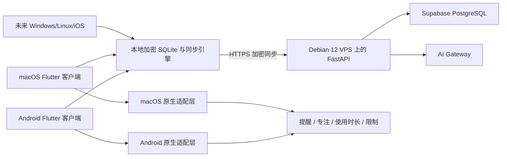

# StudyFlow 个人学习与作息管理系统设计

状态：已完成产品设计确认，等待实现前的文档复核
日期：2026-08-11
适用范围：个人使用，Android 与 macOS 首发，预留 Windows、Linux、iOS

## 1. 产品目标

StudyFlow 是一个本地优先的个人学习时间管理与作息辅助系统。它将学习任务、休息、娱乐、睡眠和实际执行记录放在同一条时间线上，在 Android 与 macOS 之间同步，并逐步引入 AI 建议。

首版目标不是让 AI 强制接管设备，而是先跑通以下闭环：

```text
创建任务/日程
  -> 离线保存
  -> 加密同步
  -> 专注计时与手动确认
  -> AI 复盘与提出调整建议
  -> 用户确认后调整未来日程
```

系统默认只读取任务、日程、完成记录和主动反馈。读取应用/网站使用时长属于单独的授权 B 权限，不读取窗口内容和原始浏览内容。

## 2. 范围边界

### 2.1 首版包含

- 学习任务、休息、娱乐、睡眠时间块。
- 任务预计时长、优先级、重复规则和完成状态。
- Android 与 macOS 客户端。
- 本地优先、断网可用、恢复网络后同步。
- 记录级加密同步。
- 提醒、专注计时、手动完成确认。
- 年龄区间、设备时区、目标起床时间、睡眠时长设置。
- AI 生成今日计划、复盘和作息建议。
- 未来日程调整的撤销记录。
- Supabase 托管 PostgreSQL 作为数据库，Debian 12 VPS 运行 FastAPI。

### 2.2 后续阶段

- Android 授权后的应用使用时长汇总。
- Android 应用/网站限制实验。
- macOS 菜单栏应用、Focus 适配和限制能力实验。
- Windows、Linux、iOS 客户端和平台适配器。
- 学习成果证据，例如文件、代码提交和测验结果。
- CalDAV/ICS 日历互操作。

### 2.3 明确不包含

- 任意远程操作设备。
- 读取窗口内容、屏幕内容或原始浏览历史。
- VPS 上运行本地大模型。
- 多用户协作、社交和团队功能。
- 自动锁死设备且无法由用户撤销的限制。
- 医疗诊断、睡眠障碍诊断或替代专业治疗。

## 3. 总体架构



### 3.1 客户端

- Flutter 负责界面、任务、日程、计时器和大部分业务流程。
- Drift + SQLite 负责本地数据；使用 SQLite3MultipleCiphers 加密本地数据库。
- 每个平台通过原生适配层提供通知、使用时长、Focus 和限制能力。
- 客户端在断网时仍可创建、修改和完成任务。
- 同步失败必须显示状态，不得静默丢失本地修改。

### 3.2 VPS

- Debian 12 Bookworm。
- Docker Engine 与 Docker Compose。
- Caddy 负责 HTTPS 和域名入口。
- FastAPI 负责认证、设备配对、同步、AI Gateway 和策略校验。
- VPS 不运行 PostgreSQL；数据库使用 Supabase 托管实例。

### 3.3 Supabase

- 仅使用 Supabase PostgreSQL，不让 Flutter 客户端直接访问 Supabase。
- FastAPI 保存 Supabase 数据库连接凭据，凭据只存在 VPS secret 或受保护的环境配置中。
- 运行时使用 Supavisor session pooler 的明确 `:5432` URL，并使用无 `BYPASSRLS` 的专用应用角色（禁止使用 `postgres`/Data API 角色）；如果 VPS 有 IPv6，可为迁移和备份使用 direct connection。
- 明确拒绝 Supavisor transaction pooler 的 `:6543` URL 作为长期运行的 SQLAlchemy 连接，因为 transaction mode 不支持 prepared statements；direct PostgreSQL URL 不受该 pooler 端口限制。
- 对同步表启用 RLS 作为纵深防御，并使用权限受限的应用数据库角色。
- 不在客户端暴露 `service_role`、数据库密码或其他管理密钥。

Supabase 的项目连接方式、pooler 模式和 RLS 要在部署前用实际项目设置验证。当前项目引用为 `ovmjefbczdizvuyghpgg`；认证和 MCP 配置不写入仓库。

## 4. 数据模型

### 4.1 客户端领域对象

- `UserProfile`：年龄区间、时区、目标起床时间、目标睡眠时长、通知偏好。
- `Task`：标题、说明、预计时长、优先级、状态、标签、重复规则。
- `ScheduleBlock`：开始时间、结束时间、类型、关联任务、来源、锁定状态。
- `FocusSession`：任务、开始时间、结束时间、暂停记录、结果、确认方式。
- `CheckIn`：睡眠时长、睡眠质量、精力、情绪、主动反馈。
- `RestrictionRule`：平台、作用域、时间范围、规则类型、启用状态。
- `ActivitySummary`：授权 B 后的应用/网站分类时长，只在本地生成原始统计。
- `AIRecommendation`：建议内容、输入摘要、规则校验结果、采纳状态、撤销信息。
- `SyncOperation`：操作 ID、设备 ID、记录 ID、逻辑时钟、加密载荷和墓碑状态。

### 4.2 服务端同步表

服务端只需要保存同步所需的最小信息：

- 用户/设备标识。
- 不透明的记录 ID 和操作 ID。
- 顺序游标或逻辑时钟。
- 加密后的操作载荷。
- 加密墓碑、创建时间和同步状态。

任务正文、反馈正文、作息笔记和 AI 输入内容必须在客户端加密后再上传。

## 5. 加密与密钥

### 5.1 密钥层级

1. 首台设备生成账户数据密钥和设备密钥。
2. 数据密钥用于加密同步载荷和本地敏感数据库。
3. Android 设备密钥保存在 Android Keystore。
4. macOS 设备密钥保存在 Keychain。
5. 新设备通过一次性配对码加入，并获得加密后的数据密钥。
6. 用户可导出独立恢复密钥；服务器不能代替用户恢复该密钥。

密码学算法使用经过审查的库，不自行实现加密算法。记录加密采用 libsodium 兼容的 AEAD 方案；具体 Flutter 库和原生实现由实现计划阶段的安全代理验证。

### 5.2 AI 隐私边界

同步数据采用客户端到服务端的记录级加密。AI 请求是显式功能调用，但不属于端到端加密同步链路：客户端只发送完成本次建议所需的结构化数据，FastAPI 临时转发给配置的模型提供方；系统不持久化原始提示、模型响应或活动原文，只保留用户采纳所需的建议摘要和审计元数据。

如果未来支持完全本地 AI，则使用相同的 `AI Gateway` 接口替换模型提供方，不改变业务层。

## 6. 同步协议与冲突

- 客户端生成 UUIDv7 或等价的时间可排序 ID。
- 每个修改生成幂等的 `operation_id`。
- 服务端按游标提供增量操作，不直接合并明文业务字段。
- 客户端应用操作并维护本地同步游标。
- 普通任务采用字段级、确定性的最后写入合并。
- 时间块在两个设备同时修改时保留冲突副本并要求用户确认。
- 已完成的专注记录只追加，不覆盖原始历史。
- 删除使用加密墓碑，墓碑保留至所有已登记设备确认同步。
- Supabase 暂时不可用时，客户端继续本地运行并显示待同步数量。

首版不引入完整 CRDT。个人多设备场景使用“加密操作日志 + 字段级合并 + 时间块冲突提示”即可，复杂度更可控。

## 7. AI 监督与作息策略

### 7.1 AI 权限阶梯

- L0：规则模板、提醒和专注计时。
- L1：根据任务、日程、完成记录和主动反馈提出建议。
- L2：用户确认后，AI 才能修改未来日程。
- L3：默认连续 14 天存在有效记录并再次授权后，AI 才能自动调整未来日程，并联动提醒/限制；14 天阈值可由用户提高，但不能在未再次授权时自动开启。

每一次 AI 调整必须保存原安排、调整理由、输入摘要和撤销入口。

### 7.2 规则与模型职责

- 睡眠时长、不可重叠、已锁定日程、最小休息间隔等由确定性规则引擎校验。
- LLM 负责解释、排序、提出候选安排和生成复盘文本。
- LLM 不直接写数据库；只能返回结构化建议。
- Pydantic 校验结构化输出，策略引擎再次验证后才进入确认流程。

### 7.3 作息调整

- 使用设备时区作为本地时间来源。
- 以目标起床时间作为主要锚点。
- 首版使用年龄区间和用户设定的睡眠时长，不推断具体疾病或诊断。
- 每次小幅调整睡眠窗口，默认步长为 15–30 分钟，并可由用户修改。
- 默认保持工作日与周末的合理一致性。
- 连续严重睡眠不足、长期无法入睡或白天异常困倦时，只提示寻求专业帮助。

成人健康建议通常强调规律作息和每晚至少 7 小时睡眠；产品只将其作为一般行为辅助边界，不替代医疗建议。[CDC Sleep](https://www.cdc.gov/sleep/about/index.html)；[AASM Adult Sleep Duration](https://aasm.org/advocacy/position-statements/adult-sleep-duration-health-advisory/)

## 8. 平台适配

### 8.1 Android 首发基线

真实验收设备：

- 设备：iQOO Z9 Turbo。
- 型号：`V2352A`。
- 系统版本：`PD2352B_A_16.2.15.0.W10.V000L1`。
- Android 安全更新：2026-05-01。
- 内核显示：`6.1.145-android14-11-maybe-dirty`。

Android 端首版优先实现：

- 本地提醒和系统闹钟。
- 专注计时与手动完成。
- 离线同步队列。
- 权限健康检查：通知、闹钟、后台运行、电池优化、使用情况访问。
- 授权 B 后通过 `UsageStatsManager` 生成应用使用时长汇总。

不把常驻后台服务作为正确性的前提。应用限制首先做真机实验；`AccessibilityService` 属于高敏感权限，必须有清晰披露、用户主动开启和合规验证，不作为同步 MVP 的核心依赖。

验收覆盖：熄屏、锁屏、清理后台、重启、电池优化、断网、恢复网络、系统时间变化、权限撤销和应用被系统停止后的恢复提示。

### 8.2 macOS

- Flutter 主界面和菜单栏入口。
- UserNotifications 提醒。
- 登录项/后台运行状态可见化。
- Focus 先做状态感知和应用内联动。
- 应用/网站限制需要单独验证 Screen Time entitlement 和原生扩展能力。

### 8.3 其他平台

- Windows：通知、专注计时、Focus 状态感知；应用限制通过单独代理或浏览器扩展评估。
- Linux：优先 freedesktop/D-Bus 桌面通知和专注计时；限制能力按桌面环境最佳努力实现。
- iOS：后续接入 Apple Screen Time 相关 entitlement；发布前需验证 Family Controls 审批和个人授权流程。

统一能力接口：

```text
scheduleReminder()
startFocusSession()
getUsageSummary()
applyRestriction()
clearRestriction()
getPermissionStatus()
```

每个平台必须返回能力是否支持、权限是否缺失和失败原因，不能假设所有平台都能执行同一种限制。

## 9. 技术栈

### 9.1 客户端

- Flutter stable / Dart。
- Riverpod：状态管理。
- GoRouter：导航。
- Drift：类型安全的 SQLite 访问、迁移和响应式查询。
- SQLite3MultipleCiphers：本地数据库加密。
- 原生 Kotlin 与 Swift 适配器：通知、使用时长、Focus、限制。

### 9.2 服务端

- Python 与 FastAPI。
- Pydantic：请求、响应和 AI 结构化输出校验。
- SQLAlchemy 2：Supabase PostgreSQL 访问。
- Alembic：数据库迁移。
- Poetry + `pyproject.toml`：依赖锁定。
- 结构化日志、健康检查、同步指标和错误分类。

### 9.3 基础设施

- Debian 12 Bookworm。
- Docker Engine、Docker Compose、Caddy。
- Supabase PostgreSQL。
- `pg_dump` 加密异地备份。
- 不在 VPS 上运行向量数据库或本地大模型，直到真实数据规模证明必要。

## 10. 仓库结构

```text
StudyFlow/
├── apps/
│   └── client/                 # Flutter 主客户端
├── packages/
│   ├── domain/                 # 领域模型与规则接口
│   ├── sync_contract/          # 同步协议与版本规则
│   └── platform_contract/      # 平台能力接口
├── server/
│   ├── app/
│   │   ├── api/                # FastAPI 路由
│   │   ├── auth/               # 认证与设备配对
│   │   ├── sync/               # 加密同步
│   │   ├── ai/                 # AI Gateway
│   │   └── scheduler/          # 作息与日程规则引擎
│   └── tests/
├── infra/
│   ├── docker-compose.yml
│   ├── Caddyfile
│   └── backup/
├── docs/
└── tests/
    ├── contract/
    ├── integration/
    └── device/
```

## 11. 开发阶段

### Phase 0：基础验证

- 验证 Debian 12、Docker、Caddy、Supabase 连接和备份恢复。
- 用实际 Supabase 项目验证 IPv4/IPv6、session pooler、迁移和连接上限。
- 建立 Flutter 在 Android 与 macOS 的最小运行壳。
- 在 iQOO Z9 Turbo V2352A 上验证通知、闹钟和权限状态读取。

### Phase 1：本地任务与日程

- 本地加密数据库。
- Task、ScheduleBlock、FocusSession 和 CheckIn。
- 离线操作队列和本地冲突显示。

### Phase 2：同步与设备配对

- 账户、设备密钥、配对码、恢复密钥。
- FastAPI 加密操作日志。
- Supabase 数据库迁移、RLS 和异地备份。
- Android 与 macOS 双向同步验收。

### Phase 3：AI 与作息建议

- 确定性规则引擎。
- L1 建议、结构化输出、用户确认和撤销。
- 睡眠/作息历史和每周复盘。

### Phase 4：平台控制实验

- Android UsageStats 授权 B。
- Android 应用/网站限制原型。
- macOS Focus 和限制能力原型。

### Phase 5：扩展平台

- Windows、Linux、iOS 的通知和专注计时。
- 各平台限制能力按可用 API 逐步增加。

## 12. 验收标准

1. Android 离线创建任务，macOS 恢复网络后能够收到同一任务。
2. macOS 修改日程，Android 能正确同步；同时修改时间块时显示冲突而不是静默覆盖。
3. Supabase 暂时不可用时，本地任务、计时和完成确认仍可用。
4. 服务器数据库中无法直接读出任务标题、反馈和 AI 输入正文。
5. 恢复密钥可以在新设备恢复数据；丢失恢复密钥时系统明确提示无法代为恢复。
6. AI 建议不会直接修改已确认日程；L2 之前必须经过用户确认。
7. OriginOS 6 上应用被清理或权限被撤销时，系统显示明确的同步/提醒异常状态。
8. 备份可以恢复到新的 Supabase 项目或等价 PostgreSQL 环境。
9. Windows、Linux、iOS 的缺失能力不会阻塞 Android 与 macOS 首发。

## 13. 并行代理分工

设计文档阶段不修改代码。实现计划获得批准后，采用不重叠范围：

- 安全代理：威胁模型、密钥层级、同步载荷和恢复流程。
- Android 代理：OriginOS 6、通知、后台、UsageStats 和权限健康检查。
- macOS 代理：菜单栏、通知、Focus 和原生限制能力。
- 后端代理：FastAPI、Supabase 连接、迁移、同步 API。
- Flutter 代理：本地数据库、领域模型、任务/日程/计时界面。
- 测试代理：契约测试、离线测试、真机矩阵和恢复演练。

安全和平台代理使用高推理强度模型；机械性样板代码和测试可使用较快模型。代理不跨越任务边界，不擅自提交代码，由主代理集中比较基线与最终 diff。

## 14. 可借鉴的成熟项目

- [Super Productivity](https://github.com/super-productivity/super-productivity)：参考任务、时间盒、专注、休息提醒和本地隐私设计；MIT 许可证。
- [ActivityWatch](https://github.com/ActivityWatch/activitywatch)：参考本地活动事件与时间统计模型；MPL-2.0 许可证；仅作为授权 B 的后续参考。
- [Nextcloud Calendar](https://github.com/nextcloud/calendar)：参考 CalDAV 与日历互操作；AGPL-3.0，不直接嵌入首版核心代码。
- [Vikunja](https://github.com/go-vikunja/vikunja)：参考自部署任务 API 和任务模型；AGPL-3.0，不直接拼装到首版代码中。

开源项目的产品思路和代码许可证分开评估；首版优先借鉴数据模型和交互，不直接复制 AGPL/MPL 代码。

## 15. 设计决策总结

最终采用：

```text
Flutter + Drift/SQLite
Kotlin/Swift 原生平台适配层
FastAPI + SQLAlchemy + Alembic
Debian 12 + Docker Compose + Caddy
Supabase PostgreSQL
客户端记录级加密
AI 规则引擎 + 可替换 LLM Gateway
Android iQOO Z9 Turbo V2352A 与 macOS 首发
```

首个可交付闭环是“跨设备加密日程同步 + 手动专注记录 + AI 建议”，不是强制设备接管。
